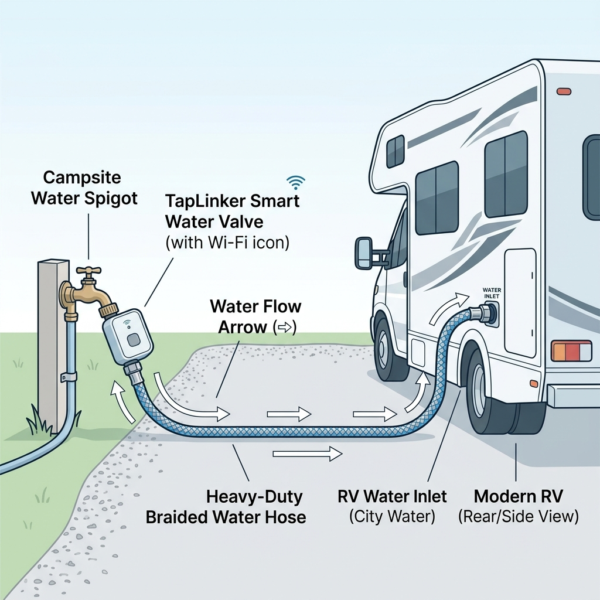
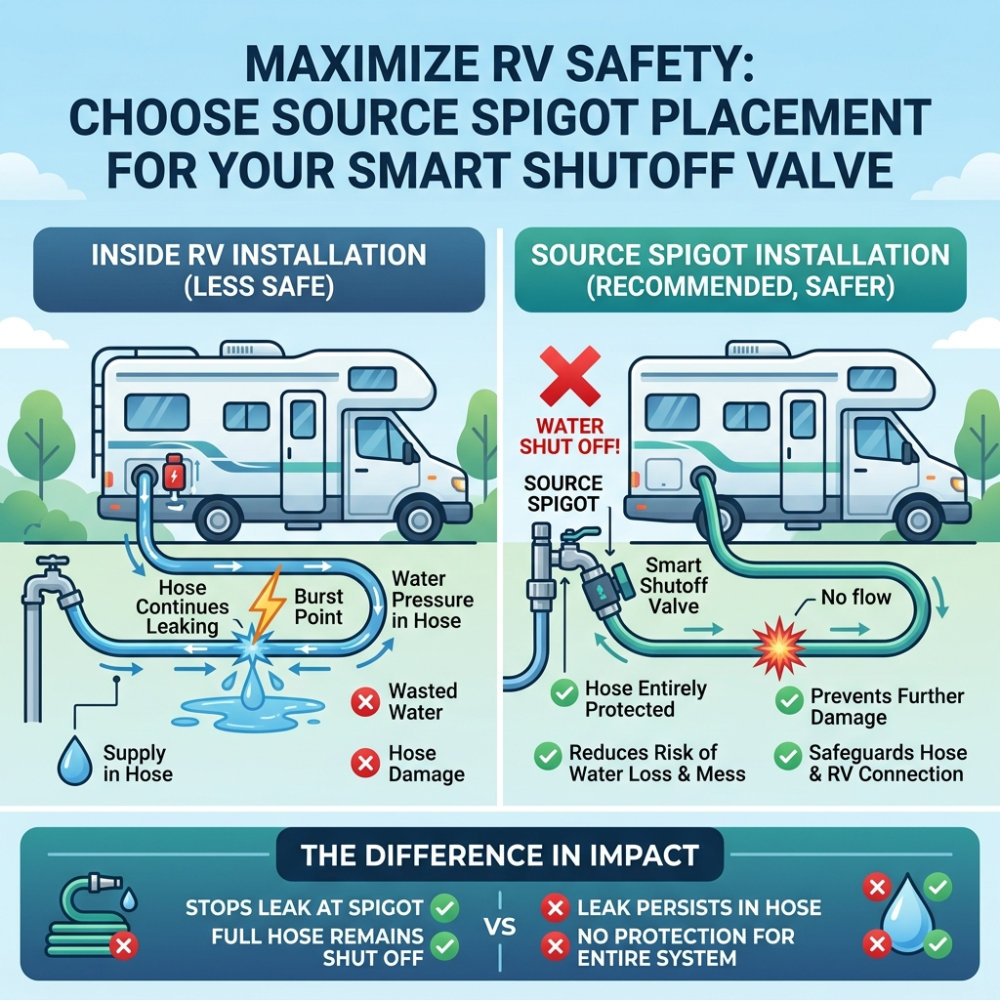

# Physical Setup Guide: Boats & RVs

When setting up your smart water valve for a Boat or RV, physical placement is just as important as the software itself. To maximize safety and prevent catastrophic water damage, it is highly recommended to install the smart valve directly at the **source spigot**, rather than inside your vehicle.

## The Ideal Configuration

For the safest configuration, your components should be arranged in the following order:

1. **Source Spigot** (Campsite/Marina water source)
2. **Smart Water Valve** (e.g., TapLinker, attached directly to the spigot)
3. **Heavy-Duty Braided Water Hose** (Connects the valve to the RV/Boat)
4. **RV/Boat City Water Inlet**

## Why Place the Valve at the Source?

Many RV owners make the mistake of installing pressure regulators, filters, and smart valves directly onto the water inlet on the side of their RV. **This leaves the water hose completely unprotected.**

### The Danger of Hose Bursts
Water hoses are exposed to UV rays, physical wear, and fluctuating campsite water pressures. They are often the weakest link in your plumbing setup. If a hose bursts while you are away, water will spray continuously. 
* If your smart valve is inside the RV or attached to the inlet, it cannot stop a leak happening *before* the valve.
* If your smart valve is at the source spigot, it controls the flow into the hose itself.

### Benefits of Source-Spigot Installation
* **Complete Hose Protection:** The smart valve monitors flow through the hose. If the hose ruptures, the valve detects the abnormal continuous flow and shuts off the water at the source, preventing flooding around your campsite or marina slip.
* **Internal Plumbing Protection:** It still provides full protection for all internal plumbing inside your RV or Boat. Any burst pipe inside will also be detected and shut off at the source.
* **Reduced Weight on Inlet:** Smart valves and gateways can be heavy. Hanging them off your RV's plastic water inlet can stress and crack the internal fittings over time. Keeping the weight on the sturdy metal campsite spigot prevents structural damage to your vehicle.

## Best Practices
- **Use a Pressure Regulator:** Always install a water pressure regulator. We recommend placing it *after* the smart valve to protect your hose from high-pressure spikes.
- **Support the Valve:** If your setup is heavy (e.g., adding Y-splitters or filters), use a hose support stand or block to take the weight off the campsite spigot.
- **Check Wi-Fi Range:** Ensure your smart valve is still within range of its wireless Gateway when attached to the spigot. Modern long-range protocols usually have no problem reaching from inside an RV to the outside spigot.

## Flood Sensors & Webhooks

To add an extra layer of protection, you can deploy standalone water leak sensors (such as the **Shelly Flood Gen4**) inside your Boat or RV. 

When configuring a Shelly Flood sensor:
1. Connect the sensor to the same local Wi-Fi network as your Boat & RV Guardian app.
2. Open the sensor's Web Admin interface in your browser.
3. Navigate to **Actions / Webhooks**.
4. Set the **Condition** to trigger when water is detected.
5. Set the **URL** to point to the local instance of your Guardian app using port 3030:
   `http://<YOUR_COMPUTER_IP>:3030/api/webhook/flood`
6. Make sure it uses the `POST` method.

Whenever the sensor detects a leak, it will fire this webhook, instantly triggering the Guardian app to close the main valve at the spigot.
